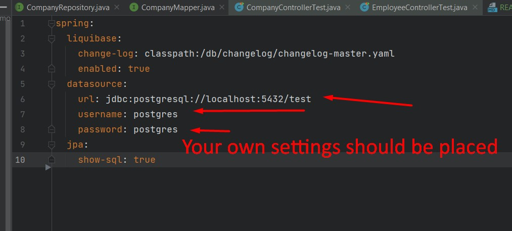
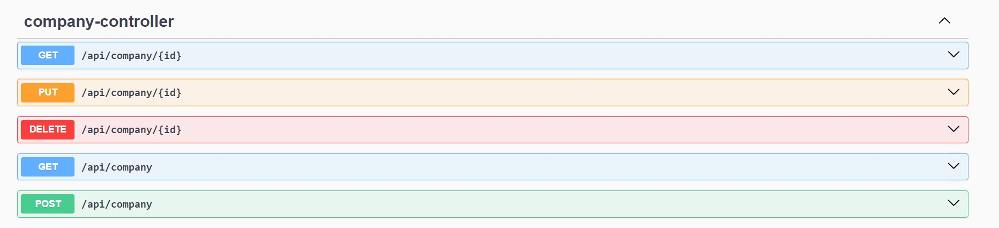
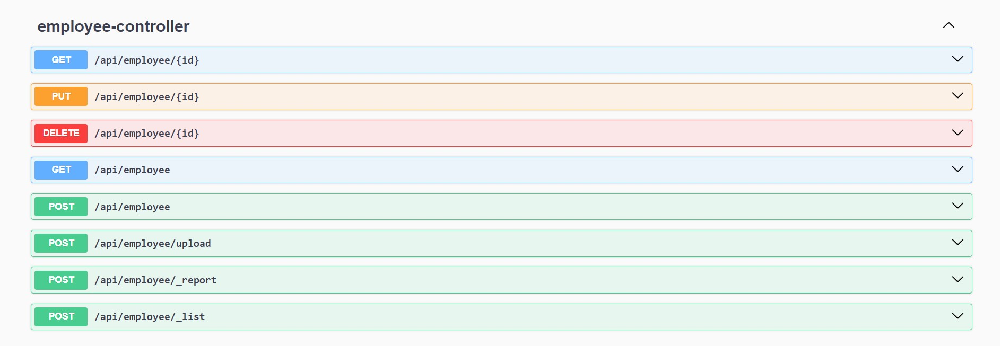

<h1>ProfitSoft Intern Task2</h1>
<h3>1. Description</h3>
<p> Simple REST API Java project which describes entities Employees-Companies</p>
<h3>2. Launch instructions</h3>

```cmd
git clone https://github.com/FilosofDanil/intern_task_2
```

After you clone your repo, all that you need is to add maven project and launch it.
You should launch the project from the main class or manually build it using maven tools.

But before that you should set up your own database settings in application.yml file.


<h3>3. System estimation</h3>

Entities:

- There are 2 main entities provided: Employees and Companies
- Employee and Company have M:1 relationship
- The main fields which describe Employee: name, surname, companyName, hiringDate, salary, jobs
- Jobs are considered as enum variable and every employee might be hired for different positions

Endpoints:
Company Resource:

Employee Resource:

<h3>4. Input and output examples(JSON)</h3>
Here  is provided examples of JSONs and JSON file with test data for company and employee endpoints:

For company:
```json
{
  "name": "Example Company",
  "country": "Example Country",
  "foundationDate": "2020-01-01"
}

```
For employee:
```json
{
  "name": "John",
  "surname": "Doe",
  "salary": "50000",
  "hiringDate": "2022-01-01",
  "job": "FRONTEND_DEVELOPER",
  "company": {
    "name": "Example Company",
    "country": "Example Country",
    "foundationDate": "2020-01-01"
  }
}

```
JSON file, which may be uploaded on employee API endpoint:
```json
[
    {
        "name": "Daniil",
        "surname": "NoBerk",
        "salary": "2000",
        "hiringDate": "2024-04-26",
        "job": "SALES",
        "company": {
            "name": "Loh_Gmbh",
            "country": "Ukraine",
            "foundationDate": "2024-04-25"
        }
    },
   {
        "name": "Daniil",
        "surname": "NoBerk",
        "salary": "2000",
        "hiringDate": "2024-04-26",
        "job": "SALES"
    }
]
```
